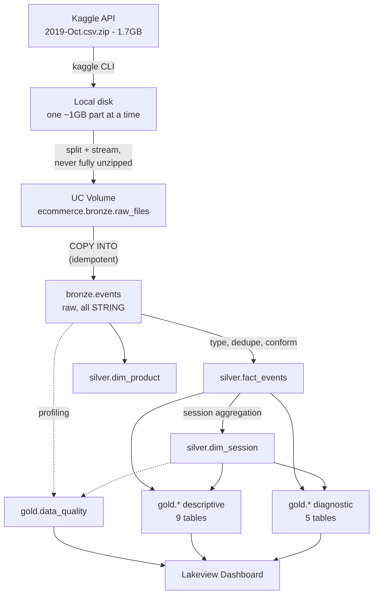
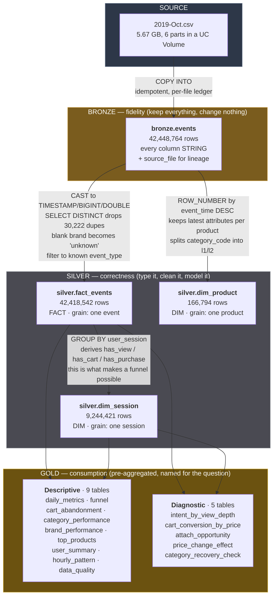
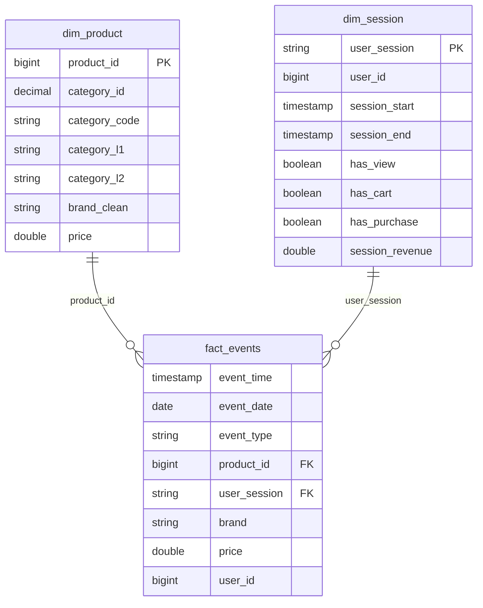

# E-commerce Behavior Analytics on Databricks

> ### In short
>
> **The problem**
> An online store had 42 million rows of raw click logs sitting in a file — nobody
> could query it, and nobody knew why half of all shopping carts were being
> abandoned or where the money was leaking.
>
> **What we did**
> Turned that file into a clean, governed Databricks lakehouse with a dashboard
> and plain-English search, then found the real problems: cart abandonment is not
> about price (it's checkout friction), almost no one is sold an accessory with
> their phone (~$2.6M/month missed), and $41.6M sits with customers who are ready
> to buy but were never asked.

---

A complete lakehouse implementation over the Kaggle
[eCommerce behavior data from a multi category store](https://www.kaggle.com/datasets/mkechinov/ecommerce-behavior-data-from-multi-category-store)
dataset: 42M raw clickstream events → Unity Catalog governed medallion data
model → Lakeview dashboard + AI/BI Genie → a documented set of business findings
and five sized, actionable problems.

This README is the single source of truth for **what was built, why each
decision was made, and how to run or extend it**. Anyone picking this up
should not need to ask.

---

## Table of contents

1. [Business context — why this exists](#1-business-context--why-this-exists)
2. [The dataset](#2-the-dataset)
3. [Architecture and why it looks like this](#3-architecture-and-why-it-looks-like-this)
4. [Ingestion: the hard part, and how it was solved](#4-ingestion-the-hard-part-and-how-it-was-solved)
5. [The data model, layer by layer](#5-the-data-model-layer-by-layer)
6. [Data quality: the issues found and how they were handled](#6-data-quality-the-issues-found-and-how-they-were-handled)
7. [The dashboard and Genie](#7-the-dashboard)
8. [Production hardening](#8-production-hardening) — performance, security, scheduling, monitoring
9. [Business findings](#9-business-findings) — **[problems worth acting on](#problems-worth-acting-on)**
10. [Repo layout](#10-repo-layout)
11. [How to run it](#11-how-to-run-it)
12. [Design decisions and trade-offs](#12-design-decisions-and-trade-offs)
13. [Extending this](#13-extending-this)

---

## 1. Business context — why this exists

Raw clickstream logs are not an asset. A 5.7GB CSV of `view`/`cart`/`purchase`
rows cannot be queried by a merchandiser, cannot be joined to anything, has no
governance, and answers no question on its own.

The goal is to turn that file into a **governed, queryable, trustworthy model**
that answers the questions a retail business actually asks:

| Question | Where it's answered |
|---|---|
| Where do shoppers drop out between browsing and buying? | `gold.funnel` |
| How much revenue is stuck in abandoned carts? | `gold.cart_abandonment` |
| Which categories earn their shelf space, and which just get browsed? | `gold.category_performance` |
| Which brands drive volume vs. value? | `gold.brand_performance` |
| When are we busiest (staffing, promo timing, deploy windows)? | `gold.hourly_pattern` |
| Do buyers come back? | `gold.user_summary` |
| **Can I trust any of the above?** | `gold.data_quality` |
| *Why* is half the cart abandoned — price or friction? | `gold.cart_conversion_by_price` |
| Who is most likely to buy but hasn't yet? | `gold.intent_by_view_depth` |
| Are we selling accessories with the phones? | `gold.attach_opportunity` |
| Do our discounts actually work? | `gold.price_change_effect` |

That last row is deliberate and is covered in
[section 6](#6-data-quality-the-issues-found-and-how-they-were-handled). A model
that reports numbers without reporting its own defects is worse than no model,
because it converts a known unknown into an unknown unknown.

---

## 2. The dataset

Real behavioral data from a large multi-category online store, October–November
2019. One row per user interaction event.

| Column | Meaning |
|---|---|
| `event_time` | UTC timestamp of the event |
| `event_type` | `view`, `cart`, or `purchase` |
| `product_id` | Product identifier |
| `category_id` | Numeric category identifier |
| `category_code` | Dotted taxonomy, e.g. `electronics.smartphone` (often blank) |
| `brand` | Brand name (often blank) |
| `price` | Unit price at event time |
| `user_id` | Persistent user identifier |
| `user_session` | Session identifier |

**Scale**: 5.7GB / ~42M rows for October alone; 9GB for November.
**Currently loaded**: all of October 2019 — 42,448,764 rows, Oct 1 00:00:00 to
Oct 31 23:59:59 UTC (see [section 13](#13-extending-this) for adding November).

The dataset documents `remove_from_cart` as a possible `event_type`, but it does
**not appear** in the October file — only three event types are present. The
silver-layer filter still accepts it so that adding a month containing it
requires no code change.

---

## 3. Architecture and why it looks like this



### Why medallion (bronze / silver / gold)?

Each layer has exactly one job, which makes failures diagnosable:

- **Bronze** — *fidelity*. Every column is `STRING`. Nothing is cast, nothing is
  dropped, nothing is cleaned. If a downstream number looks wrong, bronze is the
  reference to check against. Casting at ingest would destroy the evidence
  needed to debug it.
- **Silver** — *correctness*. Types, deduplication, conformed dimensions,
  derived attributes. This is where business rules about *what the data means*
  live.
- **Gold** — *consumption*. Pre-aggregated, denormalized, named for the business
  question they answer. The dashboard reads **only** from gold, so a dashboard
  query never scans 42M rows.

The alternative — one big transformation from CSV to dashboard — is faster to
write once and impossible to debug or extend afterwards.

### Why Unity Catalog?

- **Three-level namespace** (`ecommerce.silver.fact_events`) — layer membership
  is visible in every reference; no naming conventions to enforce by hand.
- **Volumes** — governed file storage for the raw CSVs. This workspace has the
  legacy DBFS root disabled (a good security posture), so Volumes are the
  supported ingestion path, not just the preferred one.
- **Lineage** — UC tracks table-to-table lineage automatically, so the
  bronze→silver→gold flow is visible in Catalog Explorer without maintaining a
  diagram that goes stale.
- **Informational constraints** — declared PK/FK relationships make the model
  self-describing and let the optimizer eliminate provably redundant joins.

### Why a serverless SQL warehouse and not a Spark cluster?

This workload is pure SQL: `COPY INTO` plus a set of `CREATE TABLE AS SELECT`
statements. A SQL warehouse needs no cluster configuration, no node-type
decision, auto-starts on first query, and auto-stops after 10 minutes idle. A
general-purpose cluster would add operational surface area and cost for zero
capability gain. If this later needs Python UDFs, ML, or streaming, that's the
point at which a cluster earns its place.

All orchestration runs through the **Statement Execution API** over plain
HTTPS — no notebooks, no cluster attach, no local Spark install. The pipeline is
therefore runnable from any machine or CI runner with an environment variable
set.

---

## 4. Ingestion: the hard part, and how it was solved

This was the least obvious part of the build, and three separate approaches
failed before one worked. Documented here so nobody retries a dead end.

### The constraints

| Constraint | Value |
|---|---|
| Uncompressed CSV | 5.67 GB |
| Free local disk | ~13 GB |
| Files API single-`PUT` limit | 5 GiB |
| Legacy DBFS root | **disabled** in this workspace |

### What was tried

| # | Approach | Result |
|---|---|---|
| 1 | Buffer whole CSV in memory, one `PUT` | Would need ~6GB RAM. Rejected before running. |
| 2 | Chunked `PUT` of the full 5.67GB file | **`BrokenPipeError`** — exceeds the 5 GiB per-request limit. |
| 3 | DBFS block API (`create`/`add-block`/`close`) | **`PERMISSION_DENIED`** — public DBFS root disabled under UC. Correct security posture; wrong tool. |
| 4 | **Split into ~1GB parts, stream each to a UC Volume** | **Works.** |

### The working approach — [`scripts/split_upload.py`](scripts/split_upload.py)

```
zip member ──read line by line──> ~1GB part on local disk
                                       │
                                       ├─ PUT to UC Volume
                                       └─ delete local part, reuse the space
```

Key properties, and why each matters:

- **The 5.67GB CSV is never fully written to disk.** Only one ~1GB part exists
  at a time. Peak local usage is ~1GB against 13GB free, instead of 5.7GB
  against 13GB.
- **Splitting happens on line boundaries, and every part carries the header
  row.** A byte-offset split would tear a row in half and silently corrupt
  whichever record straddled the boundary. Every part is independently valid CSV.
- **Each part is under the 5 GiB Files API limit**, so a plain `PUT` works with
  no multipart-session complexity.
- **Multiple files in a directory are a feature, not a workaround.** Spark reads
  a directory of CSVs as one logical table, and it parallelizes better than one
  large file would.
- **Uploads are retried and size-verified.** A multi-minute PUT over a consumer
  connection will occasionally die mid-stream with a broken pipe — this happened
  on the final part of the first full run, losing that part after the other five
  had succeeded. Verification matters as much as the retry: a PUT can return
  success while the stored object is short, and a truncated CSV sitting in the
  volume would be ingested silently as real data. Each part is re-checked
  against its local size, and an already-correct part is skipped, which makes a
  crashed run resumable rather than restartable.

### On throughput

Measured upstream to the Databricks control plane from a normal office
connection was **~2 MB/s**. That sets the floor: ~8 minutes per 1GB part, ~47
minutes for a 5.67GB month. This is bandwidth, not a code problem — chunk size
and connection count were not the limiting factor. Budget accordingly, and
prefer running ingestion from a cloud host in the same region when loading
multiple months.

### Why `COPY INTO` rather than `CREATE TABLE ... USING CSV`

`COPY INTO` keeps a **per-file load ledger**. Re-running it skips files already
ingested and loads only new ones. Two direct consequences:

1. **Ingestion could start before the upload finished.** Bronze was loaded from
   4 of 6 parts while parts 5 and 6 were still uploading, and the remaining
   parts were picked up by simply re-running the same statement. No coordination
   logic, no "is the upload done yet" polling in the pipeline.
2. **Adding November is one re-run.** Drop the files in the volume, re-run the
   pipeline; October is not re-read.

`_metadata.file_path` is captured into `source_file` so every bronze row can be
traced back to the exact file it came from.

---

## 5. The data model, layer by layer

### The medallion flow, with what actually happens at each step



**Why the row counts change the way they do**

| Step | Rows | What happened |
|---|---|---|
| Source CSV → bronze | 42,448,764 | 1:1. Bronze is a faithful copy — nothing dropped. |
| Bronze → `fact_events` | 42,418,542 | −30,222 (0.07%). Almost entirely exact-duplicate events: only **2** rows failed the null/event-type filter, so 30,220 were dupes. |
| `fact_events` → `dim_session` | 9,244,421 | Collapsed from events to **one row per session** — this is the grain change that makes funnel analysis possible. |
| Bronze → `dim_product` | 166,794 | Deduplicated to **one row per product**, keeping the most recent attributes. |

The 0.07% duplicate rate is what you'd expect from client-side retries and
double-firing analytics tags — small, but worth removing before it inflates
view counts.

### Star schema

The silver layer is a classic star: one fact table, two conformed dimensions.



### Bronze — `ecommerce.bronze.events`

**Grain**: one row per source CSV row.
**Types**: every column `STRING`, deliberately.

Casting at ingest means a single malformed value fails the load of an entire
file, and the offending value is gone by the time anyone investigates. Keeping
bronze untyped means ingestion essentially cannot fail on data content, and
bronze remains a faithful, queryable copy of the source for debugging.

Adds one column not present in the source: `source_file`, for lineage.

### Silver — typed, deduplicated, conformed

**`silver.fact_events`** — grain: one distinct
`(event_time, user_session, product_id, event_type)`.

- Casts to real types (`TIMESTAMP`, `BIGINT`, `DOUBLE`)
- `SELECT DISTINCT` removes exact duplicate events — these exist in the source,
  typically from client-side retry or double-firing analytics tags
- Derives `event_date` once, so daily aggregates never re-cast at query time
- Blank `brand` becomes `'unknown'` rather than `NULL` — `NULL` silently
  disappears from `GROUP BY` output, whereas `'unknown'` shows up as a visible
  row and makes the gap impossible to overlook
- Filters to known `event_type` values, keeping `remove_from_cart` accepted for
  forward compatibility

**`silver.dim_product`** — grain: one row per `product_id`.

Products change brand/category/price over time in this data. The dimension keeps
the **most recent** observation per product, via
`ROW_NUMBER() OVER (PARTITION BY product_id ORDER BY event_time DESC)`. This is
a Type-1 slowly-changing dimension: current state only, no history.

That is the right call *here* because the analytical questions are about current
catalog performance. It would be the wrong call for questions like "what was the
price when this order was placed" — but the fact table already stores `price` at
event time, so point-in-time price is preserved where it matters.

Also splits `category_code` into `category_l1` / `category_l2` so the taxonomy
can be rolled up without string manipulation in every downstream query.

**`silver.dim_session`** — grain: one row per `user_session`.

This is the most important table in the model. It collapses the event stream
into one row per session carrying `has_view` / `has_cart` / `has_purchase`
flags.

**Why session-level and not event-level for the funnel**: a shopper who views
the same phone eleven times has not moved through eleven funnels. Counting raw
events measures *engagement*; counting sessions measures *shoppers making
progress*. Every funnel, conversion, and abandonment metric downstream is
session-based for this reason.

### Gold — 14 business-facing tables

**Descriptive** — what happened ([`sql/03_gold.sql`](sql/03_gold.sql),
[`04_data_quality.sql`](sql/04_data_quality.sql)):

| Table | Grain | Business question |
|---|---|---|
| `daily_metrics` | one row per day | Traffic, revenue, conversion trend |
| `funnel` | one row (whole period) | Where do sessions drop out? |
| `cart_abandonment` | one row per day | How much money is stuck in carts? |
| `category_performance` | one row per category | Which categories earn their space? |
| `brand_performance` | one row per brand | Volume vs. value by brand |
| `top_products` | top 100 by revenue | What actually sells? |
| `user_summary` | one row per user | Buyer frequency, spend, recency |
| `hourly_pattern` | one row per hour-of-day | When are we busiest? |
| `data_quality` | one row per check | **Can these numbers be trusted?** |

**Diagnostic** — what is broken and what it's worth
([`sql/09_opportunities.sql`](sql/09_opportunities.sql)):

| Table | Grain | Problem it identifies |
|---|---|---|
| `intent_by_view_depth` | one row per view band | High-intent non-buyers: $41.6M of unconverted intent |
| `cart_conversion_by_price` | one row per price band | Abandonment is flat above $50 — friction, not price |
| `attach_opportunity` | one row per attached category | Attach rate is 2.1% against a 15–30% norm |
| `price_change_effect` | one row per price move | Discounting shows no visible conversion lift |
| `category_recovery_check` | one row | **Negative result**: missing categories are unrecoverable |

The split matters. The descriptive tables answer *"how are we doing"* and belong
on a weekly review. The diagnostic tables answer *"what should we fix"* and each
one maps to a decision — see [`docs/OPPORTUNITIES.md`](docs/OPPORTUNITIES.md).

Gold tables are materialized rather than views. The dashboard has ~18 widgets;
as views, each widget refresh would re-scan the 42M-row fact table. Materialized,
the dashboard queries touch tables of a few hundred rows. Cost of the trade:
gold is stale until the pipeline re-runs — acceptable for a daily-refresh
analytics use case, and `CREATE OR REPLACE` makes the refresh a single re-run.

### Governance — [`sql/05_governance.sql`](sql/05_governance.sql)

- **Comments** on catalog, schemas, every table, and any column whose meaning is
  not self-evident. Every table's **grain is documented in its comment** — the
  single most common source of misuse in an analytics model is someone assuming
  the wrong grain and double-counting.
- **`PRIMARY KEY` / `FOREIGN KEY` constraints** declared `RELY NOT ENFORCED`.
  Databricks does not enforce these — they are *informational*. They earn their
  place by (a) rendering the ER diagram in Catalog Explorer, (b) documenting the
  intended grain in a machine-readable way, and (c) allowing the optimizer to
  eliminate joins it can prove are redundant.
- **`CHECK` constraint** on `event_type`, which *is* enforced. This one encodes
  a real business rule: if a new event type ever appears in source data, the
  pipeline should fail loudly rather than silently drop it from the funnel.

---

## 6. Data quality: the issues found and how they were handled

Profiling ran before any business metric was trusted. It found one issue serious
enough to invalidate the headline metric.

### The blocking issue: cart events are systematically under-logged

The first funnel build — run on a partial load of ~30M rows while the rest was
still uploading — produced this:

```
cart_to_purchase_pct = 110.16%
```

More sessions contained a purchase (450,901) than contained a cart (409,308).
Arithmetically impossible in a funnel where cart precedes purchase.

**Root cause**: **over half of purchasing sessions have no cart event at all.**
The source tracking drops the cart step for the majority of completed purchases.

The defect is structural, not a sampling artifact: it measured 53.9% on the
partial load and **53.6% on the full month**, and the corrected funnel ratios
likewise barely moved (cart→purchase 69.10% → 69.12%). Whatever is dropping
cart events is doing so at a steady rate rather than in bursts, which points at
a systematic tracking gap rather than intermittent event loss.

**How it was handled** — the funnel is computed **monotonically**: a session
that purchased is credited with having reached the cart stage, and any session
that carted or purchased is credited with having reached the view stage.

**Crucially, the raw numbers are retained alongside the adjusted ones**:

| Column | Meaning |
|---|---|
| `sessions_with_cart` | Adjusted — includes purchases with no logged cart |
| `sessions_cart_logged` | Raw — cart events actually present in source |
| `purchases_missing_cart_event` | The size of the gap |

This is the important part of the approach. Silently patching the number would
produce a plausible dashboard built on an invisible assumption. Publishing both
means a reader can see exactly how much of the funnel is measured and how much
is inferred.

Result after the fix — and note the *direction* of the correction:

| | Before (raw) | After (monotonic) |
|---|---|---|
| view → cart | 6.14% | **9.85%** |
| cart → purchase | **109.85%** (impossible) | **69.12%** |
| view → purchase | 6.81% | 6.81% |

The naive version did not just look silly — it **understated cart adds by 37%**
and would have sent the team optimizing checkout, which is the part that already
works.

### All checks — `gold.data_quality`

| Check | Affected | % | Business consequence |
|---|---|---|---|
| `purchase_without_cart` | 337,699 sessions | **53.6%** of purchases | Funnel invalid unless computed monotonically |
| `missing_category_code` | 13,515,609 rows | **31.8%** | 10.1% of revenue sits in an `unknown` bucket |
| `missing_brand` | 6,113,008 rows | **14.4%** | Brand ranking biased toward well-tagged brands |
| `multiday_sessions` | 17,086 sessions | 0.18% | Session ids reused across visits; inflates duration |
| `zero_or_negative_price` | 68,670 rows | 0.16% | Distorts AOV if not excluded |
| `purchase_without_view` | 939 sessions | 0.15% | Sessions starting mid-journey (deep links) |

**Why this is a table and not a footnote**: it's queryable, it's on the
dashboard, and it re-computes every pipeline run. If a future month arrives with
worse tracking, the number moves and somebody sees it. A README caveat would go
stale the day it was written.

**The principle applied throughout**: bad data is surfaced, never silently
dropped. Blank brands become a visible `'unknown'` row rather than vanishing
from a `GROUP BY`. The cart gap is published next to the corrected figure. The
reader can always see the shape of what is missing.

---

## 7. The dashboard

Built via [`scripts/create_dashboard.py`](scripts/create_dashboard.py) against
the Lakeview API. Re-running **updates in place** (it looks up the dashboard by
display name and `PATCH`es it) rather than creating duplicates.

Layout, top to bottom — deliberately ordered as *headline → diagnosis → detail →
caveats*:

1. **KPI row** — revenue, sessions, users, conversion %, abandoned cart value
2. **Funnel + daily revenue** — the headline story and its trend
3. **Daily conversion % + abandoned value over time** — is it getting better?
4. **Category and brand revenue** — where the money comes from
5. **Revenue by hour + category conversion** — operational timing, and which
   categories convert rather than merely attract traffic
6. **Buyer segments** — users and revenue by purchase frequency
7. **Top products table**
8. **Data quality table** — titled *"read before trusting the numbers above"*

The data-quality panel is placed last on purpose: a reader who scrolls the whole
dashboard ends on the caveats, rather than bouncing off them at the top before
seeing anything useful.

Defining the dashboard **as code** rather than clicking it together in the UI
means it is reviewable in a pull request, reproducible in another workspace, and
diffable when it changes.

---

### AI/BI Genie — natural language access

[`scripts/create_genie_space.py`](scripts/create_genie_space.py) provisions a
Genie space so non-technical users can ask questions in plain English rather
than filing a request for a SQL query.

Genie is scoped to the **gold layer only** — those tables are small,
business-named, and pre-aggregated, which is exactly what a text-to-SQL system
needs. Pointing it at bronze would invite 30M-row scans and meaningless
column names.

**The instructions matter more than the table list.** Without them Genie would
happily compute `purchases / carts` from raw counts and report a **110%
cart-to-purchase rate** to a business user with no way to know it was wrong.
The space is therefore given five instruction blocks:

1. **The cart-tracking caveat** — always use `gold.funnel`, never divide raw
   counts, and disclose that the cart stage is partly inferred
2. **Other data caveats** — unknown-bucketing, purchase = completed sale, no
   quantity column
3. **Grain rules** — `gold.funnel` is one row (never `GROUP BY` it),
   `hourly_pattern` is a daily profile not a time series, and gold tables must
   never be joined to each other because each is independently aggregated
4. **Business context** — revenue concentration, where the funnel actually
   leaks, UTC→local time conversion
5. **Worked SQL examples** for the most common questions

Verified working. Asked *"What is our purchase funnel and where are we losing
the most people?"*, Genie selected `gold.funnel`, returned the correct figures,
identified view→cart as the drop-off — and **volunteered the caveat unprompted**:
*"The cart stage is partly inferred due to tracking gaps."*

Schema note: the `serialized_space` payload shape is not publicly documented
and was determined empirically. Three constraints are easy to trip over and are
handled in the script: `data_sources.tables` **must be sorted** by identifier,
`instructions.text_instructions` accepts **at most one item** (separate
paragraphs go in its `content` array), and `content` entries must be plain
strings.

## 8. Production hardening

The model and dashboard answer the business question. These pieces are what
make it survivable in production rather than a one-off analysis.

### Performance — [`sql/06_optimize.sql`](sql/06_optimize.sql)

**Liquid clustering** on `fact_events` by `(event_date, product_id)`, chosen
over date partitioning for two reasons: at ~30M rows/month, date partitions are
small enough to cause the small-file problem, and partitioning is a one-way door
— changing the key means rewriting the table. Liquid clustering stays adjustable
and handles skew, which matters because event volume is far from uniform across
days and products. Achieved **0.93 clustering quality** on first run.

Also: auto-optimize and auto-compact properties, tuned retention windows per
layer (bronze is a reproducible reload, so a long time-travel window buys little
and costs storage), and `ANALYZE ... COMPUTE STATISTICS` so the cost-based
optimizer stops guessing cardinality on a 30M-row join.

### Security and classification — [`sql/07_security.sql`](sql/07_security.sql)

`user_id` is a surrogate, not a name — but it is a persistent identifier tied to
an individual's browsing and purchase history, which makes it **pseudonymized,
not anonymized**, and personal data under GDPR-style regimes. It is tagged as
such, along with table-level tags for domain and PII presence.

The tags are not decoration: they make *"where does personal data live"* a SQL
query (`ecommerce.ops.pii_inventory`) instead of a tribal-knowledge question,
which is exactly what gets asked during an access review.

A **column mask** (`mask_user_id`) is defined but deliberately **not applied**.
It hashes `user_id` for anyone outside `ecommerce_pii_readers`, deterministically
— so `COUNT(DISTINCT)` and `GROUP BY` still work while the ability to single out
a person is removed. It is left inactive because applying a mask keyed to a group
that does not exist yet would break every existing query; the group is created
first, then two commented `ALTER` statements activate it.

### Scheduling — [`scripts/create_job.py`](scripts/create_job.py)

A Databricks Workflow wiring the same SQL files into a dependency chain:

```
bronze → silver → gold → dq ─┐
                 └ governance ┴→ optimize
```

Data quality runs **after** gold and **before** optimize, so a DQ regression
surfaces before the expensive layout work runs. Tasks are SQL-file tasks on the
same serverless warehouse — no cluster to size, no idle cost.

**Created paused.** An unpaused schedule provisioned by a script starts
consuming warehouse budget without whoever owns the bill agreeing to it.
Enabling it is one click.

### Monitoring — [`scripts/create_alerts.py`](scripts/create_alerts.py)

`gold.data_quality` records defects, but a table nobody opens is not monitoring.
Three alerts turn the failure modes that would silently corrupt every downstream
number into notifications:

| Alert | Threshold | Why this threshold |
|---|---|---|
| Cart tracking gap | > 60% | Baseline ~54%. Above 60% the funnel's cart stage is majority *inferred*, and view-to-cart should not be quoted without a caveat. |
| Gold tables stale | > 36h | Job runs daily. 36h tolerates one missed run without crying wolf, but catches a genuinely stopped pipeline. |
| Unlabeled categories | > 40% | Baseline ~32%. Above 40%, category rankings exclude so much catalog that merchandising decisions become unsafe. |

Stale gold tables are the dangerous case: they look identical to fresh ones on a
dashboard — the numbers are simply yesterday's.

Alerts ship without a schedule or notification destination, for the same reason
the job ships paused.

### Platform observability — [`sql/08_observability.sql`](sql/08_observability.sql)

Views over Unity Catalog **system tables**, in an `ecommerce.ops` schema. Views
rather than tables — system tables are already maintained and always current, so
materializing a copy would mean paying to duplicate free data.

| View | Answers |
|---|---|
| `ops.daily_dbu_cost` | What is this costing, by day and SKU |
| `ops.expensive_queries` | Which queries to optimize, ranked by *cumulative* time burned |
| `ops.pipeline_runs` | Did the scheduled refresh actually run, and did it succeed |
| `ops.table_usage` | Which tables are read — unread gold tables are maintenance burden with no return |
| `ops.pii_inventory` | Where personal data lives, for audit and access review |

For reference, building this entire project cost **~1.2 DBUs** of serverless SQL
compute.

## 9. Business findings

### Problems worth acting on

[`docs/OPPORTUNITIES.md`](docs/OPPORTUNITIES.md) goes past description to five
findings where the data names a **specific broken thing**, sizes it, and points
at a decision. Backed by `gold.*` tables that rebuild every run, so none of it
goes stale.

**Cart abandonment is not a price problem.** Cart-to-purchase is flat at ~50%
from $50 to over $1,000 — a 20× price range with no decay. If cost were the
barrier, conversion would fall as price climbs; it doesn't. Whatever stops half
of all carts is price-independent, i.e. process friction. *Below* $50 conversion
drops to 30%, which is the signature of shipping cost as a share of order value.
Everyone will assume abandonment is a discounting problem. The data says it
isn't.

**The attach-rate engine is off.** Only **2.12%** of the 285,252 smartphone
purchase sessions bought anything else — against a 15–30% norm for electronics.
Accessories are where phone retail makes its margin. Moving attach to a
conservative 10% is roughly **$2.6M/month** on headphones alone, from customers
who have already bought.

**Repeat viewing predicts purchase almost perfectly.** 10+ views of a product
converts at **43.5%**; a single view converts at ~0%. The usable part is the
non-buyers in that band: ~142,000 user-product pairs worth **$41.6M** of
unconverted intent, sitting unused. Extracting the segment is a query, not a
project.

**Discounting isn't visibly working.** Days after a >5% price cut convert at
1.62% vs 1.85% when stable — but this is confounded (prices get cut *because*
items aren't selling), so it warrants a holdout test, not a policy change.

**The missing categories cannot be recovered.** Of 372 `category_id` values
appearing with a blank code, **zero** ever appear with a populated one — the
sets are disjoint, so the obvious backfill is impossible. Recorded as a table
specifically to stop the next engineer spending a day rediscovering that.

Both the dashboard and Genie carry these tables *with their caveats attached*,
so a business user asking "should we discount more?" gets the confound explained
rather than a misleading yes.

### Descriptive findings

Full write-up with reasoning and recommendations:
**[`docs/INSIGHTS.md`](docs/INSIGHTS.md)**. Headlines from Oct 1–22 2019
(42.4M events, 9.2M sessions, 3.02M users, $229.9M revenue):

**The funnel leaks at discovery, not checkout.** 69% of carts convert — checkout
is healthy. But only 10% of viewing sessions ever cart. The addressable
population upstream is roughly 3× the one at checkout, so that is where effort
belongs.

**$99.5M sits in abandoned carts** — 43.3% of realized revenue, 281,287
sessions. Standard recovery campaigns recover 5–15%, implying $5.0M–$14.9M in a
single month with no product or pricing change.

**68% of revenue is smartphones.** A concentration risk that needs an explicit
strategic decision rather than a dashboard. Headphones (4.65% conversion, a
natural attach) look like the most obvious adjacent opportunity.

**Apple drives value, Samsung drives volume.** Samsung sells 21% more units;
Apple earns 58% more revenue at a 2.9× AOV ($778 vs $268). These should not
share a merchandising strategy.

**Some categories are pure browsing.** `apparel.shoes` takes 613K views and
returns $366K — a 0.69% conversion rate against smartphones' 4.79%. It consumes
traffic and merchandising space disproportionate to its return.

**11.5% of users buy, but 38% of buyers repeat within the month.** Weak
acquisition conversion, strong retention. That combination is a strong argument
for aggressive first-purchase incentives, because the payback is unusually good.

**Peak trading is 06:00–11:00 UTC** (≈09:00–14:00 local for this
Russian-market store) — a workday-morning pattern. Promo sends should land just
before it; deploy freezes and support staffing should respect it.

---

## 10. Repo layout

```
sql/
  01_bronze.sql        Raw table DDL + idempotent COPY INTO from the UC volume
  02_silver.sql        Typed fact + dimensions, session derivation
  03_gold.sql          Nine business aggregate tables
  04_data_quality.sql  One row per DQ check, with business impact
  05_governance.sql    Comments, PK/FK constraints, CHECK constraint
  06_optimize.sql      Liquid clustering, table properties, OPTIMIZE, ANALYZE
  07_security.sql      PII tags, table tags, column-mask function (inactive)
  08_observability.sql ops.* views over system tables: cost, query perf,
                       pipeline runs, table usage, PII inventory
  09_opportunities.sql Findings that identify a specific fixable problem,
                       size it, and point at a decision

scripts/
  split_upload.py      Streams a CSV out of the Kaggle zip into <5GiB parts and
                       uploads each to a UC Volume. Never fully unzips locally.
  dbx_sql.py           Thin client for the SQL Statement Execution API
  run_sql_file.py      Runs a .sql file statement by statement. The splitter is
                       quote-aware: a naive split on ';' breaks on semicolons
                       inside string literals, which this codebase has.
  run_pipeline.py      Orchestrates all five SQL layers in order. Idempotent.
  create_dashboard.py  Creates or updates the Lakeview dashboard
  create_genie_space.py  Creates or updates the AI/BI Genie space, including
                       the instructions that stop it reporting the broken
                       raw funnel to business users
  create_job.py        Uploads sql/ to the workspace and creates the scheduled
                       Workflow (created PAUSED)
  create_alerts.py     Creates SQL alerts on data quality and freshness
                       (no schedule or recipients by default)

docs/
  INSIGHTS.md          Business findings, reasoning, and recommendations
  OPPORTUNITIES.md     Five specific problems, sized, with what to do about
                       each -- and one thing NOT to attempt
```

---

## 11. How to run it

### Prerequisites

```bash
export DATABRICKS_HOST="https://<workspace>.cloud.databricks.com"
export DATABRICKS_TOKEN="<personal access token>"
export DBX_WAREHOUSE_ID="<sql warehouse id>"
```

Kaggle credentials at `~/.kaggle/access_token` (newer `KGAT_…` token format) or
`~/.kaggle/kaggle.json` (legacy). Install the CLI with `uv tool install kaggle`.

### One-time: catalog structure

```bash
python3 scripts/dbx_sql.py "CREATE CATALOG IF NOT EXISTS ecommerce"
python3 scripts/dbx_sql.py "CREATE SCHEMA IF NOT EXISTS ecommerce.bronze"
python3 scripts/dbx_sql.py "CREATE SCHEMA IF NOT EXISTS ecommerce.silver"
python3 scripts/dbx_sql.py "CREATE SCHEMA IF NOT EXISTS ecommerce.gold"
python3 scripts/dbx_sql.py "CREATE VOLUME IF NOT EXISTS ecommerce.bronze.raw_files"
```

### Ingest a month

```bash
kaggle datasets download -d mkechinov/ecommerce-behavior-data-from-multi-category-store -f 2019-Oct.csv
python3 scripts/split_upload.py 2019-Oct.csv.zip 2019-Oct.csv \
    /Volumes/ecommerce/bronze/raw_files/2019-Oct ./tmp_parts
```

Upload throughput is bounded by local upstream bandwidth — budget roughly 10
minutes per GB on a typical office connection.

### Run the pipeline

```bash
python3 scripts/run_pipeline.py
```

Or a single layer: `python3 scripts/run_pipeline.py silver`.
Layer names: `bronze`, `silver`, `gold`, `dq`, `governance`, `optimize`,
`security`, `observability`, `opportunities`.

### Refresh the dashboard and Genie space

```bash
python3 scripts/create_dashboard.py
python3 scripts/create_genie_space.py
```

Both look up the existing object by name and update it in place, so re-running
does not create duplicates.

**The whole pipeline is idempotent.** Re-running is always safe: `COPY INTO`
skips files it has already loaded, and silver/gold are `CREATE OR REPLACE`.

---

## 12. Design decisions and trade-offs

Recorded with reasoning so they can be revisited deliberately rather than
rediscovered by accident.

| Decision | Why | Trade-off accepted |
|---|---|---|
| Bronze columns all `STRING` | Ingest can't fail on bad values; source stays debuggable | Every downstream query casts; bronze is not directly analyzable |
| Session-grain funnel, not event-grain | Eleven views of one phone is one shopper, not eleven funnels | Sessions spanning days are slightly miscounted (0.18%, surfaced in DQ) |
| Monotonic funnel | Raw data yields an impossible 110% cart→purchase | Cart stage is partly inferred — disclosed via `sessions_cart_logged` |
| Blank → `'unknown'`, not `NULL` | `NULL` vanishes from `GROUP BY`; `'unknown'` is a visible row | Slightly noisier output, which is the point |
| Gold materialized, not views | 14 widgets × 30M-row scans is unnecessary cost and latency | Gold is stale until the pipeline re-runs |
| Type-1 dimension (current state only) | Questions asked are about current catalog performance | No historical attribute tracking; point-in-time price preserved in the fact table |
| Serverless SQL warehouse, no cluster | Workload is pure SQL; no cluster config or idle cost | Would need a cluster for Python UDFs, ML, or streaming |
| Statement Execution API, not notebooks | Runs from any machine or CI runner; reviewable as code | No interactive exploration in the pipeline itself |
| Split upload into ~1GB parts | Only path that satisfies both the 5 GiB API limit and 13GB free disk | Slower than one large upload would be; more moving parts |
| `COPY INTO`, not `CREATE TABLE USING CSV` | Per-file ledger makes re-runs incremental and safe | Slightly more verbose DDL |
| DQ as a table, not documentation | Recomputes every run; a README caveat goes stale immediately | One more table to maintain |
| Dashboard as code | Reviewable, reproducible, diffable | Slower to iterate than clicking in the UI |
| Liquid clustering, not date partitioning | 42M rows/month makes date partitions small enough to cause small-file problems; partitioning is a one-way door | Slightly less predictable than explicit partitions |
| Column mask defined but **not applied** | Masking a column against a group that doesn't exist yet would break every query | Requires a deliberate activation step |
| Job created **paused**, alerts with no recipients | A script should not start spending warehouse budget or sending mail on someone's behalf | Someone must enable them; easy to forget |
| Caveats stored **in** Genie instructions, not just docs | A business user asking "should we discount more?" gets the confound explained, not a misleading yes | Instructions must be maintained alongside the tables |
| Negative results kept as a table | Stops the next engineer re-attempting an impossible backfill every six months | A table that will always return the same row |

---

## 13. Extending this

### Add November 2019 (recommended next step)

November contains Black Friday and Cyber Monday — the highest-signal period in
the dataset, and the obvious test of whether the funnel behaves differently
under promotional traffic.

```bash
kaggle datasets download -d mkechinov/ecommerce-behavior-data-from-multi-category-store -f 2019-Nov.csv
python3 scripts/split_upload.py 2019-Nov.csv.zip 2019-Nov.csv \
    /Volumes/ecommerce/bronze/raw_files/2019-Nov ./tmp_parts
```

Then widen the `COPY INTO` source path in
[`sql/01_bronze.sql`](sql/01_bronze.sql) from `.../2019-Oct/` to
`.../` and re-run `python3 scripts/run_pipeline.py`. October is not re-read —
the `COPY INTO` ledger skips it.

### Other worthwhile extensions

- **Incremental gold.** Gold is currently a full rebuild. At two months this is
  fine (seconds); at a year it warrants `MERGE` on a date key.
- **Scheduled refresh.** Wrap `run_pipeline.py` in a Databricks Job on a daily
  schedule.
- **Cohort retention.** `gold.user_summary` has the raw material; a first-purchase
  cohort table would answer whether the 36% repeat rate holds beyond one month.
- **Liquid clustering** on `fact_events` by `event_date` once multiple months are
  loaded, to speed up date-filtered queries.
- **Alerting on `gold.data_quality`.** A Databricks SQL alert when
  `purchase_without_cart` exceeds a threshold would catch tracking regressions
  automatically.

### Known limitations

- **Purchase = completed sale.** The dataset has no payment or fulfilment status,
  so a `purchase` event is treated as revenue. Refunds and failed payments are
  invisible.
- **No quantity column.** A `purchase` row is one unit at `price`. Multi-unit
  orders cannot be distinguished from repeated single purchases.
- **Anonymized.** No geography, channel, or campaign attribution, so acquisition
  analysis is out of scope.
- **October 2019 only.** November (Black Friday / Cyber Monday) is the obvious
  next load — see section 12.
